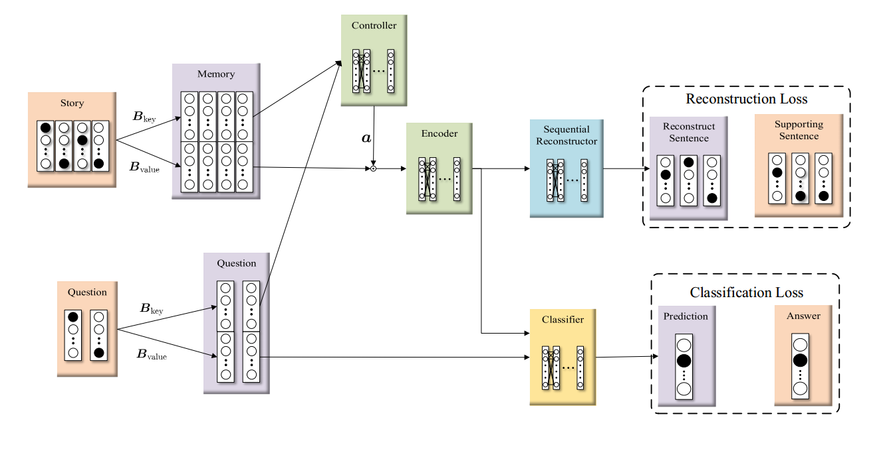
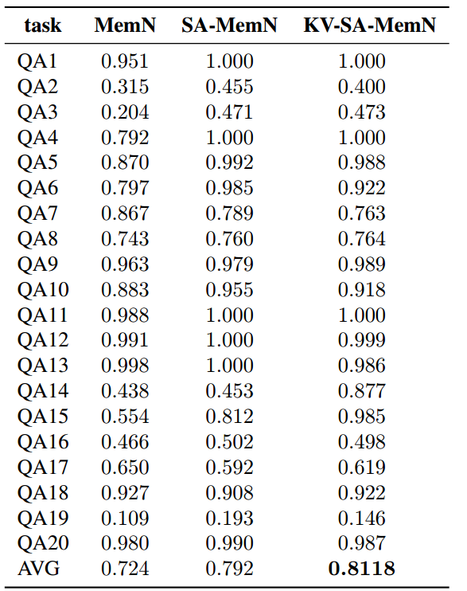
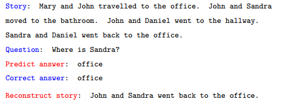

# Deep Supporting Attention in Memory Network for Question Answering
In this project, we introduce Supporting Attention into Memory Network.
We evalute this model on bAbI dataset

## Setting 
- Hardware:
    - RAM: DDR3-1600 64G
    - GPU: NVIDIA GTX 1080ti 11G

- Tensorflow: 1.2
- Keras

- Dataset:
    - bAbI: https://research.fb.com/downloads/babi/

## Result
- Answering Accuracies (\%) for bAbI tasks 

- Example

